Министерство образования Республики Беларусь

Учреждение образования

«Белорусский государственный университет

информатики и радиоэлектроники»

Факультет компьютерных систем и сетей

Кафедра программного обеспечения информационных технологий

Дисциплина «Теория информации»

ОТЧЁТ

к лабораторной работе №3

КРИПТОГРАФИЧЕСКИЕ СИСТЕМЫ С ОТКРЫТЫМ КЛЮЧОМ

Вариант 2

> Студент гр. 451001
>
> Пузик В. А.
>
> Преподаватель:
>
> Болтак С.В.

Минск, 2026

**СОДЕРЖАНИЕ**

> [1 Задание к лабораторной работе 3](#задание-к-лабораторной-работе)
>
> [2 Тестирование программы 3](#тестирование-программы)
>
> [3 Быстрое возведение в степень](#_heading=h.6m0hcpglp9iw) 12
>
> [4 Поиск первообразных корней](#_heading=h.6m0hcpglp9iw) 12
>
> [5 Расширенный алгоритм Евклида](#_heading=h.6m0hcpglp9iw) 13

## 1 Задание к лабораторной работе

Вариант 2.

Реализовать шифратор и дешифратор алгоритмаЭль-Гамаля файла c произвольным содержимым (с любым расширением), используя алгоритм быстрого возведения в степень, а также реализовать вычисление открытого ключа g при данном значении p, используя алгоритм нахождения первообразного корня по модулю (искать все первообразные корни для заданного р). Значения параметров p,x и kзадаются пользователем. Программа должна осуществлять проверку ограничений на вводимые пользователем значения параметров алгоритма. Организовать вывод содержимого зашифрованного файла (сохраненного на диске в виде потока байтов) на экран в виде чисел в 10-й системе счисления. Результат работы программы – зашифрованный/расшифрованный файл/ы.

Используя алгоритм из методички, искать все первообразные корни по модулю **p**. Все найденные корни вывести на экран и предложить для шифрования ввести на выбор любой из найденных.

Выданное простое число: 71

## 2 Тестирование программы

Все тесты запускаются с параметрами алгоритма Эль-Гамаля:

p = 257, x = 37, k = 71, g = 3.

Открытый ключ: y = g^x mod p = 3^37 mod 257 = 132, то есть (p, g, y) = (257, 3, 132).

Для файлового тестирования выбрано p = 257, так как при побайтовом шифровании произвольного файла необходимо p \> 255. Каждый исходный байт m сохраняется как пара 16-битных чисел (a, b), поэтому размер зашифрованного файла равен 4 \* размер исходного файла.

Файлы для тестирования взяты из `../task2/examples`. Результаты шифрования и расшифрования сохранены в `generated/files`.

2.1 Текстовый файл

Исходный файл: `sample.txt`, 130 байт. Зашифрованный файл: `sample.txt.eg`, 520 байт.

Параметры:

Найденные первообразные корни:

Выбор файла для шифрования:

Исходный файл в hex-viewer:

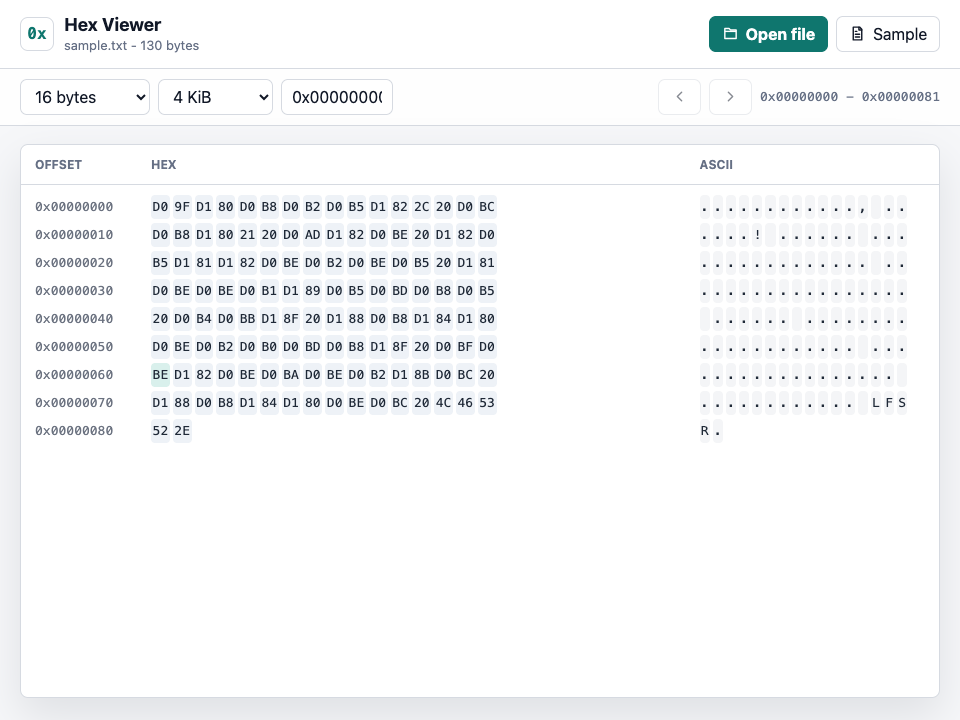

Содержимое зашифрованного файла:

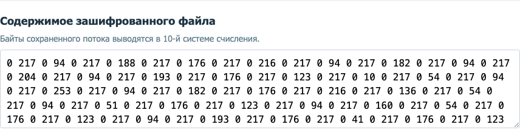

Зашифрованные блоки:

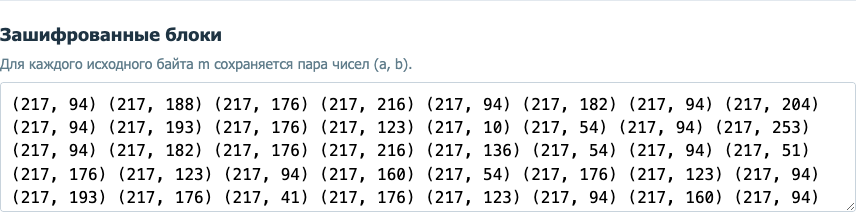

Зашифрованный файл в hex-viewer:

Выбор файла для расшифрования:

Расшифрованный файл в hex-viewer:

Состояние программы после расшифрования:

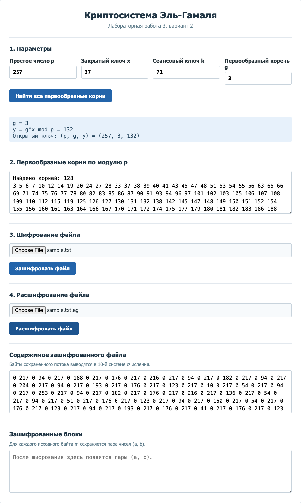

2.2 Видеофайл

Исходный файл: `7102266-hd_1920_1080_30fps.mp4`, 12 551 160 байт. Зашифрованный файл: `7102266-hd_1920_1080_30fps.mp4.eg`, 50 204 640 байт.

Параметры:

Найденные первообразные корни:

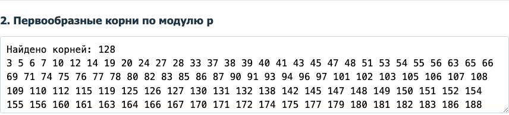

Выбор файла для шифрования:

Исходный файл в hex-viewer:

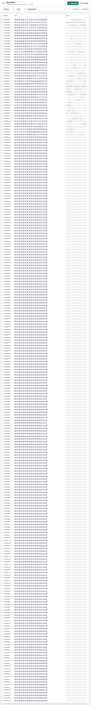

Содержимое зашифрованного файла:

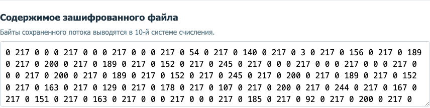

Зашифрованные блоки:

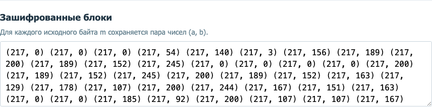

Зашифрованный файл в hex-viewer:

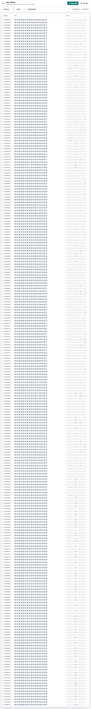

Выбор файла для расшифрования:

Расшифрованный файл в hex-viewer:

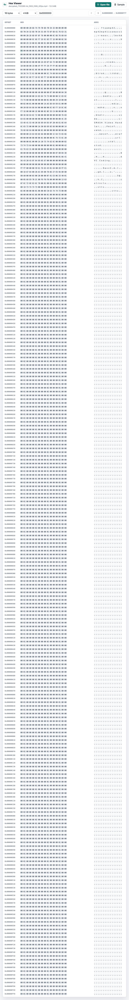

2.3 Аудиофайл

Исходный файл: `file_example_MP3_700KB.mp3`, 733 645 байт. Зашифрованный файл: `file_example_MP3_700KB.mp3.eg`, 2 934 580 байт.

Параметры:

Найденные первообразные корни:

Выбор файла для шифрования:

Исходный файл в hex-viewer:

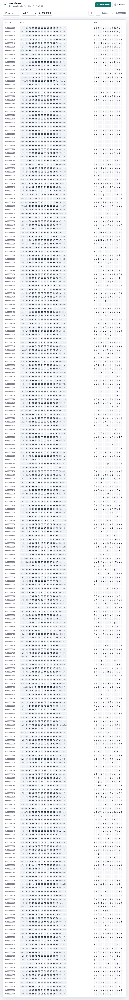

Содержимое зашифрованного файла:

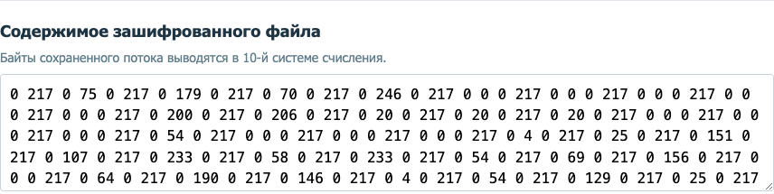

Зашифрованные блоки:

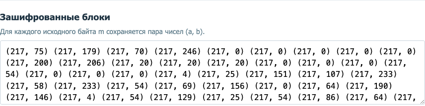

Зашифрованный файл в hex-viewer:

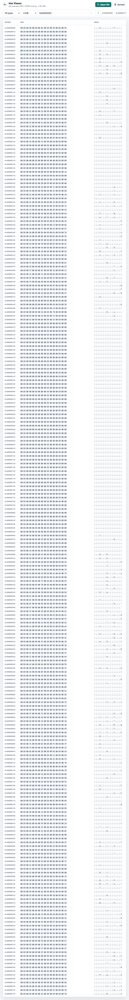

Выбор файла для расшифрования:

Расшифрованный файл в hex-viewer:

2.4 Картинка

Исходный файл: `Screenshot 2026-03-15 at 19.49.06.png`, 9 802 937 байт. Зашифрованный файл: `Screenshot 2026-03-15 at 19.49.06.png.eg`, 39 211 748 байт.

Параметры:

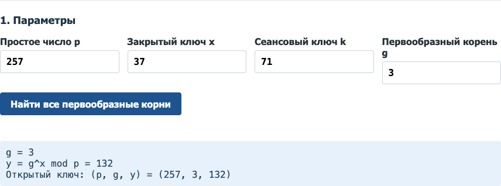

Найденные первообразные корни:

Выбор файла для шифрования:

Исходный файл в hex-viewer:

Содержимое зашифрованного файла:

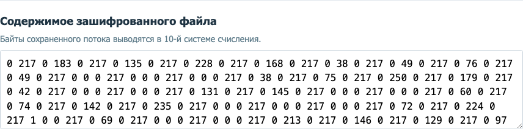

Зашифрованные блоки:

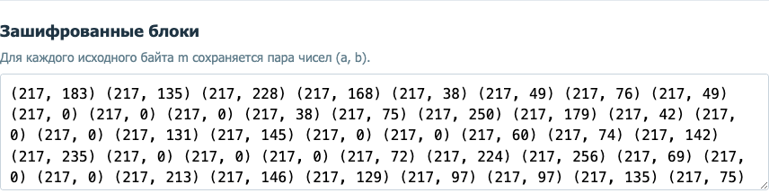

Зашифрованный файл в hex-viewer:

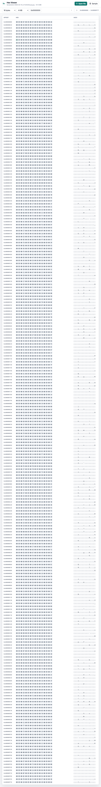

Выбор файла для расшифрования:

Расшифрованный файл в hex-viewer:

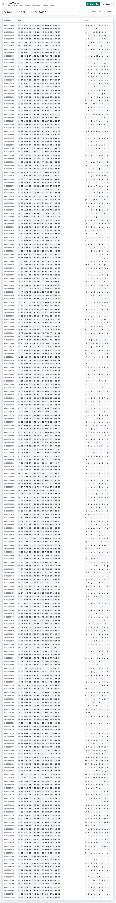

2.5 Неверный ключ

Файл `sample.txt.eg` расшифровывается с неверным закрытым ключом x = 38 вместо x = 37. Значения блоков имеют допустимый формат, поэтому программа выполняет расшифрование, но полученный файл отличается от исходного.

Параметры с неверным ключом:

Выбор зашифрованного файла:

Зашифрованный файл в hex-viewer:

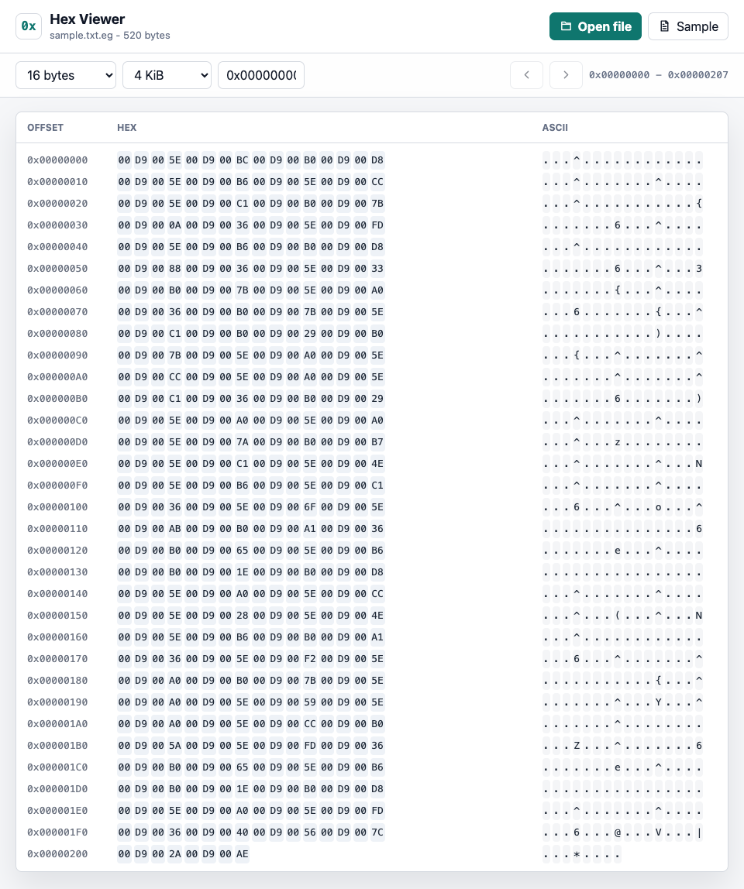

Результат расшифрования неверным ключом в hex-viewer:

Состояние программы после расшифрования неверным ключом:

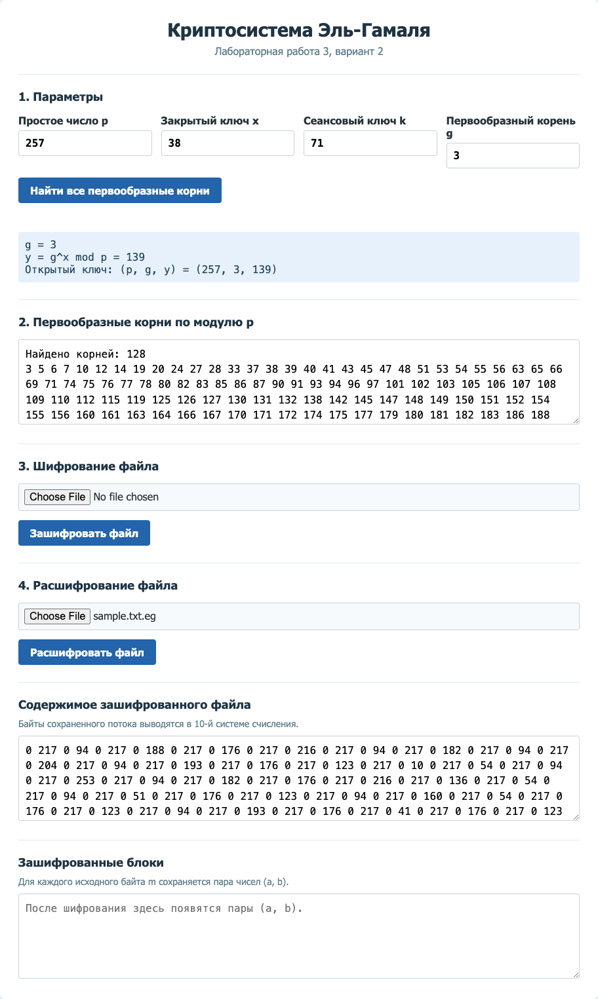

**3 Быстрое возведение в степень**

Задача: вычислить 7^13 mod 71.

7^13 mod 71 = 7 \* 7^12 mod 71 = 7 \* 49^6 mod 71 = 7 \* 58^3 mod 71 = 51 \* 58^2 mod 71 = 51 \* 27 mod 71 = 28.

| a1 (основание)         | Z (степень) | x (результат)          | Шаг |
|------------------------|-------------|------------------------|-----|
| 7                      | 13          | 1                      | 0   |
| 7                      | 12          | (1 \* 7) mod 71 = 7    | 1   |
| (7 \* 7) mod 71 = 49   | 6           | 7                      | 2   |
| (49 \* 49) mod 71 = 58 | 3           | 7                      | 3   |
| 58                     | 2           | (7 \* 58) mod 71 = 51  | 4   |
| (58 \* 58) mod 71 = 27 | 1           | 51                     | 5   |
| 27                     | 0           | (51 \* 27) mod 71 = 28 | 6   |

**4 Поиск первообразных корней**

Задано простое p = 71.

Ищем простые делители p - 1 = 70 = 2 \* 5 \* 7. Простые делители: 2, 5, 7.

Проверяем, является ли число 7 первообразным корнем по модулю 71:

7^(70/2) mod 71 = 70; 7^(70/5) mod 71 = 54; 7^(70/7) mod 71 = 45.

Ни одно из полученных значений не равно 1, поэтому число 7 является первообразным корнем по модулю 71.

Для нахождения остальных корней используем формулу g_i = g^k mod p, где k - числа, взаимно простые с p - 1, то есть НОД(k, 70) = 1.

Взаимно простые числа k: 1, 3, 9, 11, 13, 17, 19, 23, 27, 29, 31, 37, 39, 41, 43, 47, 51, 53, 57, 59, 61, 63, 67, 69.

Вычисляем 7^k mod 71:

7^1 = 7; 7^3 = 59; 7^9 = 47; 7^11 = 31; 7^13 = 28; 7^17 = 62.

7^19 = 56; 7^23 = 53; 7^27 = 21; 7^29 = 35; 7^31 = 11; 7^37 = 22.

7^39 = 13; 7^41 = 69; 7^43 = 44; 7^47 = 67; 7^51 = 52; 7^53 = 63.

7^57 = 33; 7^59 = 55; 7^61 = 68; 7^63 = 66; 7^67 = 65; 7^69 = 61.

Итоговый список всех первообразных корней по модулю 71: 7, 11, 13, 21, 22, 28, 31, 33, 35, 42, 44, 47, 52, 53, 55, 56, 59, 61, 62, 63, 65, 67, 68, 69.

**5 Расширенный алгоритм Евклида**

Для сеансового ключа k = 71 и p = 257 нужно проверить условие НОД(k, p - 1) = 1, то есть НОД(71, 256) = 1.

| итерация | q  | a0  | a1  | x0   | x1   | y0  | y1  |
|----------|----|-----|-----|------|------|-----|-----|
| 0        | -  | 71  | 256 | 1    | 0    | 0   | 1   |
| 1        | 0  | 256 | 71  | 0    | 1    | 1   | 0   |
| 2        | 3  | 71  | 43  | 1    | -3   | 0   | 1   |
| 3        | 1  | 43  | 28  | -3   | 4    | 1   | -1  |
| 4        | 1  | 28  | 15  | 4    | -7   | -1  | 2   |
| 5        | 1  | 15  | 13  | -7   | 11   | 2   | -3  |
| 6        | 1  | 13  | 2   | 11   | -18  | -3  | 5   |
| 7        | 6  | 2   | 1   | -18  | 119  | 5   | -33 |
| 8        | 2  | 1   | 0   | 119  | -256 | -33 | 71  |

119 \* 71 + (-33) \* 256 = 1.

Следовательно, НОД(71, 256) = 1, и сеансовый ключ k = 71 допустим.
